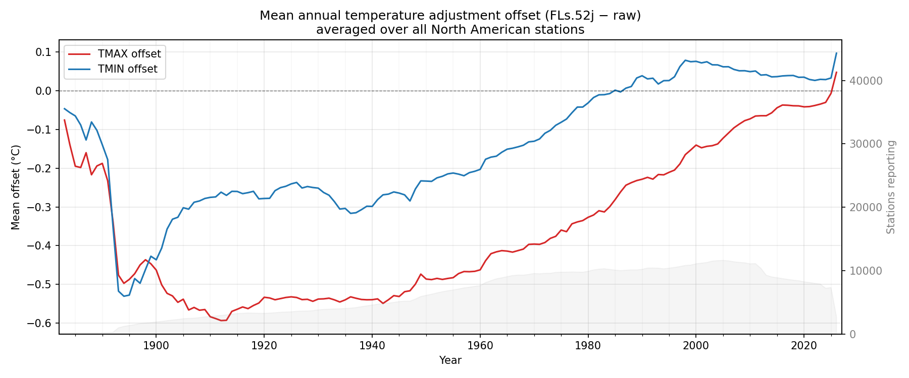

# North American Monthly Temperature Adjustment Offsets

This pipeline downloads North American monthly station temperature data from NOAA/NCEI and computes monthly adjustment offsets (FLs.52j homogenized minus raw) for TMAX and TMIN, stored in a NetCDF file.



## Output

`data/processed/monthly_offsets.nc` — a NetCDF file with dimensions `(station, time)`:

| Variable | Dimensions | Description |
|----------|-----------|-------------|
| `tmax_offset` | station × time | TMAX offset in °C (FLs.52j − raw) |
| `tmin_offset` | station × time | TMIN offset in °C (FLs.52j − raw) |
| `station_id` | station | Station identifier string |
| `time` | time | Year-month coordinate (first of month, datetime64) |

Values are NaN where either the raw or FLs.52j monthly value is missing.

## Data Source

NOAA/NCEI North American Dataset:  
https://www.ncei.noaa.gov/data/north-american-dataset/access/

Directories used:
- `tmax-raw/` — raw monthly TMAX
- `tmax-FLs.52j/` — homogenized monthly TMAX
- `tmin-raw/` — raw monthly TMIN
- `tmin-FLs.52j/` — homogenized monthly TMIN

Each directory contains one file per station (`{station_id}.raw.tmax`, etc.).  
Monthly values are stored as integer hundredths of °C; missing value is −9999.

## Setup

```bash
pip install -r requirements.txt
```

## Usage

### 1. Download data

```bash
# All North American stations (~30k stations, 4 directories)
python scripts/download_data.py --out data/raw

# Specific stations only
python scripts/download_data.py --out data/raw --station-list my_stations.txt
```

### 2. Build NetCDF

```bash
python scripts/build_offsets_netcdf.py --raw-dir data/raw --out data/processed/monthly_offsets.nc
```

### 3. Plot mean annual offsets

```bash
python scripts/plot_mean_annual_offsets.py --nc data/processed/monthly_offsets.nc --out mean_annual_offsets.png
```

## Tests

```bash
python -m pytest tests/ -v
```

## File structure

```
scripts/
  download_data.py          # Download North American monthly files
  build_offsets_netcdf.py   # Compute offsets and write NetCDF
  plot_mean_annual_offsets.py # Plot mean annual offsets over all stations
  parsers.py                # North American fixed-width parser

tests/
  test_parsers.py         # Unit tests for parser, conversions, offset logic

data/
  raw/northam/            # Downloaded per-station monthly files
  processed/
    monthly_offsets.nc    # Output NetCDF
    provenance.json       # Download timestamps and URLs
```
